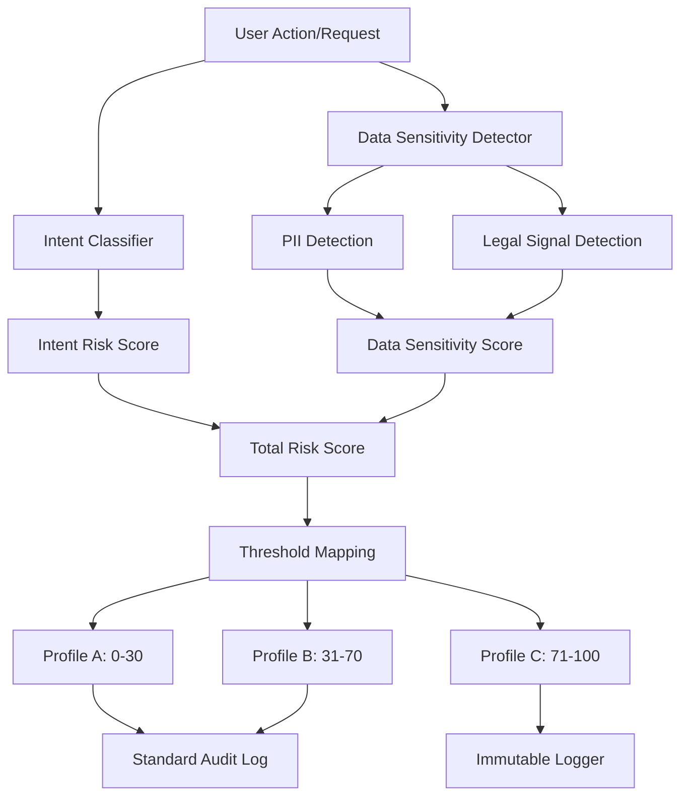

# Rule-B

ased Risk Engine Implementation Plan

## Overview

Build a rule-based risk assessment system that evaluates document access and operations based on intent classification, data sensitivity detection, and threshold-based governance profile assignment. Only Profile C (high-risk) actions require immutable logging.

## Architecture Flow

## Implementation Steps

### 1. Create Risk Engine Service

**File**: `backend/app/services/risk_engine.py`

- Create `IntentClassifier` class with:

- Prompt-based intent detection (regex patterns for export, share, delete, query, view)

- Action-based intent mapping (endpoint → intent type)

- Create `DataSensitivityDetector` class with:

- PII pattern detection (SSN, email, phone, credit card, IP)

- Legal signal keywords (privileged, confidential, restricted, sensitive)

- Sensitivity score calculation (0-100)
- Create `RiskEngine` class that:

- Combines intent risk + data sensitivity scores

- Maps total score to governance profiles via thresholds:

    - Profile A: 0-30 (low risk)

    - Profile B: 31-70 (medium risk)

    - Profile C: 71-100 (high risk)

- Returns `RiskScore` dataclass with all assessment details

### 2. Create Immutable Logger Service

**File**: `backend/app/services/immutable_logger.py`

- Create `ImmutableLogger` class that:

- Generates SHA-256 hash for each log entry

- Stores logs in append-only database table

- Provides integrity verification method

- Only called for Profile C actions

### 3. Create Database Model for Immutable Logs

**File**: `backend/app/models/audit.py` (extend existing)

- Add `ImmutableAuditLog` model with:

- Standard audit fields (user_id, action, document_id, timestamp)
- Risk score details (JSON)
- Hash field for integrity verification

- Database constraints to prevent updates/deletes (append-only)

### 4. Create Database Migration

**File**: `backend/alembic/versions/XXXX_add_immutable_audit_logs.py`

- Create `immutable_audit_logs` table

- Add CHECK constraint to prevent UPDATE/DELETE operations

- Add indexes on user_id, document_id, timestamp

### 5. Integrate Risk Assessment into Document Endpoints

**File**: `backend/app/api/v1/documents.py`

- Import `RiskEngine` and `ImmutableLogger`

- Add risk assessment to key endpoints:

- `GET /api/v1/documents/{id}/file` - document access

- `GET /api/v1/documents/{id}/content` - content retrieval

- `POST /api/v1/queries` - query submission

- `DELETE /api/v1/documents/{id}` - document deletion

- For each endpoint:

- Call `risk_engine.assess_risk()` with document text, user prompt, and action

- If `risk_score.requires_logging` (Profile C), call `immutable_logger.log_action()`

- Optionally apply governance controls based on profile

### 6. Add Configuration

**File**: `backend/app/core/config.py`

- Add risk engine configuration:

- `RISK_PROFILE_A_MAX: int = 30`

- `RISK_PROFILE_B_MAX: int = 70`

- `RISK_PROFILE_C_MAX: int = 100`

- `RISK_ENABLED: bool = True`

### 7. Update Audit Utilities

**File**: `backend/app/utils/audit.py`

- Add helper function `log_immutable_audit()` that wraps `ImmutableLogger`

- Ensure standard audit logging continues for all actions

- Immutable logging only for Profile C

## Key Design Decisions

1. **Rule-based (no ML)**: Uses regex patterns and keyword matching for transparency and auditability

2. **Intent Classification**: Dual approach - prompt text analysis and API endpoint mapping

3. **Threshold Mapping**: Simple score ranges map to governance profiles

4. **Immutable Logging**: Only Profile C actions get immutable logs with hash verification

5. **Non-breaking**: Risk assessment runs alongside existing audit logging

## Testing Considerations

- Unit tests for intent classification patterns

- Unit tests for PII detection regex
- Unit tests for threshold mapping logic

- Integration tests for immutable log creation and verification

- Test that Profile C actions create immutable logs, others don't

## Future Enhancements (Out of Scope)

- Machine learning-based risk scoring